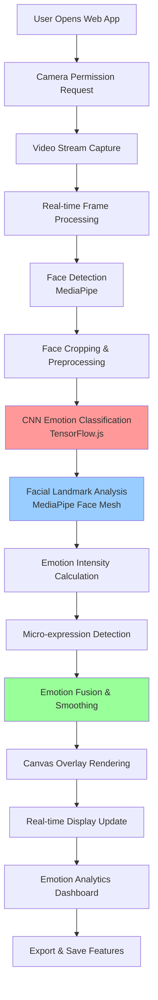

# 🎯 Truth Teller: Advanced Emotion Detection System - Implementation Roadmap

## 📋 Project Overview

**Goal**: Build an MVP web application that captures webcam feed, detects facial expressions using deep learning, and renders emotion overlays in real-time.

**Tech Stack**:
- Frontend: React Router v7 + TypeScript + Vite
- ML Framework: TensorFlow.js
- Computer Vision: MediaPipe Face Detection
- Canvas/WebGL: For real-time overlay rendering
- Webcam API: getUserMedia()

## 🗺️ Learning & Implementation Roadmap

### Phase 1: Foundation Setup (Week 1-2)
**Learning Focus**: Project setup, webcam integration, basic computer vision

#### 1.1 Project Infrastructure
- Set up React Router v7 with TypeScript and Vite
- Configure development environment with hot reload
- Install core dependencies (TensorFlow.js, MediaPipe, Canvas utilities)

#### 1.2 Webcam Integration
- Learn WebRTC getUserMedia() API
- Implement camera permission handling
- Create video stream capture and display
- Add camera selection (front/back camera support)

#### 1.3 Basic Face Detection
- Learn MediaPipe Face Detection basics
- Implement real-time face bounding box detection
- Create canvas overlay system for face tracking

### Phase 2: Deep Learning Integration (Week 3-4)
**Learning Focus**: TensorFlow.js, CNN models, emotion classification

#### 2.1 TensorFlow.js Fundamentals
- Learn TensorFlow.js browser deployment
- Understand model loading and inference
- Practice with pre-trained models (FER-2013, AffectNet)

#### 2.2 Emotion Detection Model
- Research and select advanced emotion detection models
- Options to explore:
  - **FER-2013 based models** (7 basic emotions)
  - **AffectNet models** (8 emotions + valence/arousal)
  - **Custom CNN architectures** for micro-expressions
- Convert/adapt models to TensorFlow.js format

#### 2.3 Model Integration
- Implement model loading and caching
- Create preprocessing pipeline (face cropping, normalization)
- Build inference pipeline with batch processing

### Phase 3: Advanced Emotion Analysis (Week 5-6)
**Learning Focus**: Advanced CV techniques, emotion intensity, micro-expressions

#### 3.1 Facial Landmark Detection
- Integrate MediaPipe Face Mesh for 468 facial landmarks
- Learn facial action unit (AU) detection
- Implement geometric feature extraction

#### 3.2 Intensity & Micro-expression Analysis
- Learn emotion intensity calculation methods
- Implement temporal analysis for micro-expressions
- Create emotion confidence scoring system
- Add emotion transition detection

#### 3.3 Multi-modal Emotion Detection
- Combine geometric features with CNN predictions
- Implement ensemble methods for higher accuracy
- Add emotion smoothing and filtering

### Phase 4: Visualization & UI (Week 7-8)
**Learning Focus**: Canvas rendering, real-time graphics, UX design

#### 4.1 Advanced Overlay System
- Learn HTML5 Canvas and WebGL basics
- Create dynamic emotion visualization overlays
- Implement real-time emotion intensity bars
- Add emotion history timeline

#### 4.2 Interactive UI Components
- Design emotion dashboard with React components
- Create settings panel (sensitivity, overlay styles)
- Add emotion statistics and analytics
- Implement export functionality (screenshots, data)

#### 4.3 Performance Optimization
- Learn browser performance profiling
- Optimize rendering pipeline (60fps target)
- Implement efficient memory management
- Add progressive loading for models

### Phase 5: Testing & Refinement (Week 9-10)
**Learning Focus**: Testing strategies, model evaluation, user experience

#### 5.1 Model Validation
- Create emotion testing dataset
- Implement accuracy measurement tools
- Fine-tune detection thresholds
- Add calibration features

#### 5.2 Cross-browser Compatibility
- Test on Chrome, Firefox, Safari, Edge
- Handle WebRTC compatibility issues
- Optimize for different screen sizes
- Add mobile device support

#### 5.3 Error Handling & Edge Cases
- Handle poor lighting conditions
- Manage multiple faces in frame
- Add fallback for unsupported browsers
- Implement graceful degradation

## 🏗️ Technical Architecture

## 📚 Key Technologies to Learn

### 1. **Computer Vision & ML**
- **TensorFlow.js**: Browser-based deep learning
- **MediaPipe**: Google's ML framework for face detection
- **OpenCV.js**: Advanced computer vision operations
- **Face-api.js**: Alternative face recognition library

### 2. **Web Technologies**
- **WebRTC**: getUserMedia() for camera access
- **Canvas API**: Real-time graphics rendering
- **WebGL**: Hardware-accelerated graphics
- **Web Workers**: Background processing for ML inference

### 3. **React Ecosystem**
- **React Router v7**: Latest routing patterns
- **React Hooks**: useRef, useEffect, useCallback for camera handling
- **TypeScript**: Strong typing for ML data structures
- **Vite**: Fast development and build tooling

## 🎯 MVP Feature Set

### Core Features
1. **Real-time Face Detection**: Detect and track faces in webcam feed
2. **Emotion Classification**: Detect 7+ emotions with confidence scores
3. **Intensity Analysis**: Measure emotion strength (0-100%)
4. **Visual Overlays**: Dynamic emotion labels and intensity bars
5. **Emotion History**: Timeline of detected emotions
6. **Settings Panel**: Adjust sensitivity and overlay preferences

### Advanced Features
1. **Micro-expression Detection**: Detect brief facial expressions
2. **Multi-face Support**: Handle multiple people in frame
3. **Emotion Transitions**: Track emotion changes over time
4. **Export Functionality**: Save emotion data and screenshots
5. **Calibration Mode**: Personalize detection for individual users

## 🚀 Implementation Priority

### High Priority (MVP Core)
- [ ] Basic webcam integration
- [ ] Face detection with MediaPipe
- [ ] Simple emotion classification (7 basic emotions)
- [ ] Canvas overlay system
- [ ] Real-time processing pipeline

### Medium Priority (Enhanced MVP)
- [ ] Emotion intensity calculation
- [ ] Advanced CNN model integration
- [ ] Facial landmark analysis
- [ ] Emotion smoothing and filtering
- [ ] Interactive dashboard

### Low Priority (Future Enhancements)
- [ ] Micro-expression detection
- [ ] Multi-modal emotion fusion
- [ ] Advanced analytics and export
- [ ] Mobile optimization
- [ ] Offline model caching

## 💻 Development Environment Setup

Your hardware is excellent for this project:
- **RTX 3070**: Perfect for TensorFlow.js GPU acceleration
- **16GB RAM**: Adequate for development and model loading
- **Ryzen 9 5900HX**: Great for real-time processing

**Recommended Development Tools**:
- VS Code with TensorFlow.js extensions
- Chrome DevTools for WebRTC debugging
- TensorBoard.js for model visualization
- Performance profiling tools

## 📖 Learning Resources

### Computer Vision & ML
- [TensorFlow.js Documentation](https://www.tensorflow.org/js)
- [MediaPipe Face Detection Guide](https://google.github.io/mediapipe/solutions/face_detection.html)
- [Emotion Recognition Papers](https://paperswithcode.com/task/facial-expression-recognition)
- [FER-2013 Dataset](https://www.kaggle.com/datasets/msambare/fer2013)

### Web Development
- [WebRTC getUserMedia API](https://developer.mozilla.org/en-US/docs/Web/API/MediaDevices/getUserMedia)
- [Canvas API Tutorial](https://developer.mozilla.org/en-US/docs/Web/API/Canvas_API/Tutorial)
- [React Router v7 Documentation](https://reactrouter.com/)
- [TypeScript Handbook](https://www.typescriptlang.org/docs/)

## 🎯 Success Metrics

### Technical Metrics
- **Performance**: Maintain 30+ FPS during real-time processing
- **Accuracy**: Achieve 80%+ emotion classification accuracy
- **Latency**: Keep detection latency under 100ms
- **Memory**: Optimize for under 500MB browser memory usage

### User Experience Metrics
- **Responsiveness**: Smooth overlay rendering without lag
- **Reliability**: Handle various lighting and face positions
- **Accessibility**: Support different browsers and devices
- **Privacy**: All processing happens locally in browser

## 🔄 Iterative Development Approach

1. **Week 1-2**: Build basic webcam + face detection prototype
2. **Week 3-4**: Add simple emotion classification (happy/sad/neutral)
3. **Week 5-6**: Enhance with more emotions and intensity
4. **Week 7-8**: Polish UI and add advanced features
5. **Week 9-10**: Testing, optimization, and deployment

This roadmap provides a structured approach to building your advanced emotion detection system. The learning curve is significant but manageable given your TypeScript and React experience. The key is to build incrementally, starting with basic face detection and gradually adding more sophisticated emotion analysis capabilities.